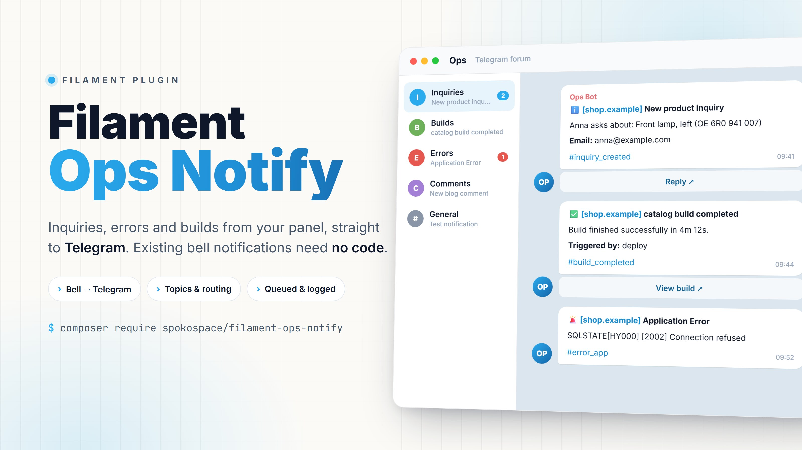

<picture>
  <source media="(prefers-color-scheme: dark)" srcset="art/cover-dark.jpg">
  
</picture>

# Filament Ops Notify

[](https://github.com/spokospace/filament-ops-notify/actions/workflows/tests.yml)
[](https://github.com/spokospace/filament-ops-notify/releases)
[](https://www.php.net)
[](https://laravel.com)
[](https://filamentphp.com)

Operational notifications for [Laravel](https://laravel.com) + [Filament](https://filamentphp.com)
panels: inquiries, errors and builds, delivered to [Telegram](https://core.telegram.org/bots/api)
forum topics. Built on [Laravel notifications](https://laravel.com/docs/notifications), so existing
[Filament database notifications](https://filamentphp.com/docs/5.x/notifications/database-notifications)
reach Telegram with no code changes.

## Features

- **Bell notifications → Telegram, no code.** Every `sendToDatabase()` notification is forwarded
  once, however many users receive it.
- **Topics and routing.** Create forum topics from the panel and route events to them by pattern
  (`inquiry.*` → *Inquiries*). Filament notifications are routed by title.
- **Settings in the panel.** Token (encrypted), chat id, service name, topics and rules, all without
  touching `.env`.
- **Reliable delivery.** Queued, retried, rate-limit aware, and never breaks the request that sent it.
- **Bot profile.** Pick an avatar (a preset or your own) and set the display name and
  descriptions from the panel.
- **Translated.** The panel ships in 25 languages, and a separate setting controls the
  language of the messages.
- **History.** Every message is logged with its status and Telegram error, and failed ones can be
  resent.
- **`ops` notification channel and a fluent `OpsMessage`** for events that are not bell notifications.
- **Channel-agnostic core.** Telegram today; other drivers plug in.

## Requirements

- PHP 8.3 / 8.4 / 8.5
- Laravel 12 / 13
- Filament 5

## Installation

```json
"repositories": [
    { "type": "vcs", "url": "https://github.com/spokospace/filament-ops-notify" }
]
```

```bash
composer require spokospace/filament-ops-notify
php artisan migrate
```

```php
use Spokospace\OpsNotify\Filament\OpsNotifyPlugin;

$panel->plugin(
    OpsNotifyPlugin::make()
        ->navigationGroup('System')
        ->authorize(fn (): bool => (bool) auth()->user()?->isAdmin()),
);
```

## Quick start

1. Create a bot with [@BotFather](https://t.me/BotFather) and a Telegram group with **Topics**
   turned on. Add the bot as an admin.
2. In the panel, open **Ops notifications → Settings** and enter the bot token and chat id.
3. Press **Send test**.

Your existing Filament notifications now reach Telegram. To send something yourself:

```php
use Spokospace\OpsNotify\OpsMessage;

OpsMessage::make('build.completed')
    ->success()
    ->title('Frontend build completed')
    ->field('Duration', '4m 12s')
    ->button('Open site', 'https://shop.example')
    ->send();
```

## Documentation

- [Setup checklist](docs/setup-checklist.md): what to set up, in order, and the rights the bot needs
- [Installation](docs/installation.md): requirements, migrations, plugin options
- [Telegram setup](docs/telegram-setup.md): bot, group, topics, finding the chat id, bot profile
- [Settings](docs/settings.md): panel vs `.env`, every option, languages, the Ops notifications page
- [Routing and topics](docs/routing-and-topics.md): topics, event rules, forwarding Filament notifications
- [Sending messages](docs/sending.md): the `ops` channel, the `OpsMessage` API, delivery, tests
- [Drivers](docs/drivers.md): adding a channel such as WhatsApp
- [Troubleshooting](docs/troubleshooting.md): common Telegram errors and fixes

## Testing

```bash
composer test
```
